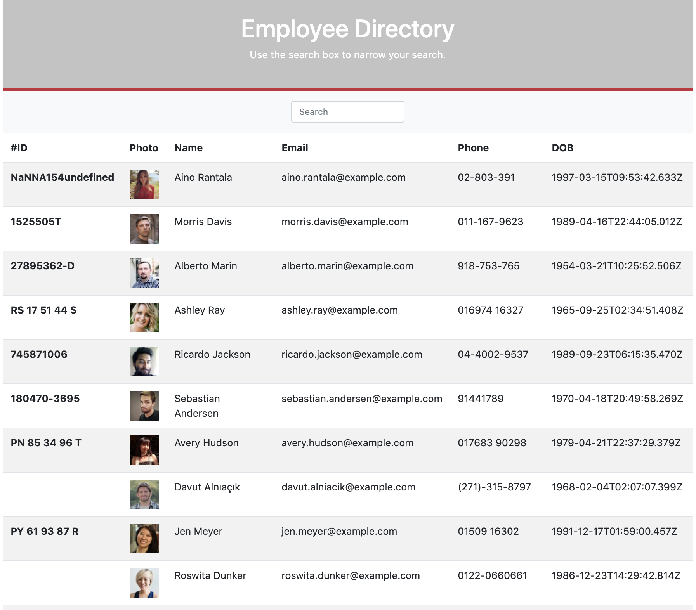

# Unit 19 React Homework: Employee Viewer app

## Description

This assignment demonstrates creating an employee directory with React. To achieve this, the application's UI has been broken down into components, manage component state, and respond to user events. When the user loads the page, a table of employees should render. The user should be able to:

  * Sort the table by at least one category

  * Filter the users by at least one property.

## User Story

* As a user, I want to be able to view my entire employee directory at once so that I have quick access to their information.

## Screenshot

## links

[Heroku Guide]()
[Github](https://github.com/Valkimani/employee-viewer-app)

## Resources

 [Random User API](https://randomuser.me/).
# License
Copyright (c) [2021] [Valentine Kimani]

Permission is hereby granted, free of charge, to any person obtaining a copy
of this software and associated documentation files (the "Software"), to deal
in the Software without restriction, including without limitation the rights
to use, copy, modify, merge, publish, distribute, sublicense, and/or sell
copies of the Software, and to permit persons to whom the Software is
furnished to do so, subject to the following conditions:

The above copyright notice and this permission notice shall be included in all
copies or substantial portions of the Software.

THE SOFTWARE IS PROVIDED "AS IS", WITHOUT WARRANTY OF ANY KIND, EXPRESS OR
IMPLIED, INCLUDING BUT NOT LIMITED TO THE WARRANTIES OF MERCHANTABILITY,
FITNESS FOR A PARTICULAR PURPOSE AND NONINFRINGEMENT. IN NO EVENT SHALL THE
AUTHORS OR COPYRIGHT HOLDERS BE LIABLE FOR ANY CLAIM, DAMAGES OR OTHER
LIABILITY, WHETHER IN AN ACTION OF CONTRACT, TORT OR OTHERWISE, ARISING FROM,
OUT OF OR IN CONNECTION WITH THE SOFTWARE OR THE USE OR OTHER DEALINGS IN THE
SOFTWARE.

